<div align="center">

# Snippets

Curated shell commands and code snippets. Search and copy, skip the chat.

[![Live][badge-site]][url-site]
[![HTML5][badge-html]][url-html]
[![CSS3][badge-css]][url-css]
[![JavaScript][badge-js]][url-js]
[![Claude Code][badge-claude]][url-claude]
[![License][badge-license]](LICENSE)

[badge-site]:    https://img.shields.io/badge/live_site-0063e5?style=for-the-badge&logo=googlechrome&logoColor=white
[badge-html]:    https://img.shields.io/badge/HTML5-E34F26?style=for-the-badge&logo=html5&logoColor=white
[badge-css]:     https://img.shields.io/badge/CSS3-1572B6?style=for-the-badge&logo=css3&logoColor=white
[badge-js]:      https://img.shields.io/badge/JavaScript-F7DF1E?style=for-the-badge&logo=javascript&logoColor=black
[badge-claude]:  https://img.shields.io/badge/Claude_Code-CC785C?style=for-the-badge&logo=anthropic&logoColor=white
[badge-license]: https://img.shields.io/badge/license-MIT-404040?style=for-the-badge

[url-site]:   https://snippets.neorgon.com/
[url-html]:   #
[url-css]:    #
[url-js]:     #
[url-claude]: https://claude.ai/code

</div>

---

## Overview

Browse a curated collection of shell commands and code snippets for macOS, bash, data extraction, text processing, Git, Docker, Kubernetes, and more. Search by keyword, filter by category, platform, or tags, and copy what you need in one click.

**Live:** snippets.neorgon.com

---

## Features

- **Instant search** -- filter snippets by title, command, keyword, or description
- **Category filters** -- 10 categories: Shell, macOS, Data, Text, Git, Config, Docker, K8s, DevOps, Claude Code
- **Platform and tag dropdowns** -- narrow results with multi-select tag filters and searchable dropdown menus
- **One-click copy** -- copy any command to clipboard with visual confirmation
- **Expandable code blocks** -- long snippets collapse with an expand toggle
- **Suggest a snippet** -- modal form to compose and copy a suggestion for new entries
- **Keyboard shortcuts** -- `/` focuses search, `Escape` clears

---

## Running locally

ES modules require an HTTP server (not `file://`):

```bash
python3 -m http.server
```

---

## Architecture



```
snippets-site/
├── index.html           # HTML shell with search, filters, grid, suggest modal
├── css/
│   └── style.css        # All styles, category accent colors, responsive grid
├── js/
│   ├── app.js           # Entry point, wires render + events
│   ├── data.js          # Static snippet collection, categories, labels
│   ├── state.js         # Filter state, search term tracking
│   ├── render.js        # Card rendering, dropdown population, filtering
│   ├── events.js        # Search, dropdown, copy, keyboard, suggest modal
│   └── utils.js         # escHtml, showToast, debounce
├── og-preview.png       # 1200x630 social preview image
├── robots.txt           # Search engine access rules
├── sitemap.xml          # Search engine sitemap
└── CNAME                # snippets.neorgon.com
```

---

<div align="center">
<sub>Part of <a href="https://neorgon.com/">Neorgon</a></sub>
</div>
