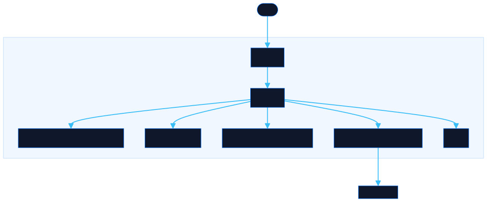

<div align="center">

# Snippets

Curated shell commands and code snippets. Search and copy, skip the chat.

[![Live][badge-site]][url-site]
[![HTML5][badge-html]][url-html]
[![CSS3][badge-css]][url-css]
[![JavaScript][badge-js]][url-js]
[![Claude Code][badge-claude]][url-claude]
[![License][badge-license]](LICENSE)

[badge-site]:    https://img.shields.io/badge/live_site-0063e5?style=for-the-badge&logo=googlechrome&logoColor=white
[badge-html]:    https://img.shields.io/badge/HTML5-E34F26?style=for-the-badge&logo=html5&logoColor=white
[badge-css]:     https://img.shields.io/badge/CSS3-1572B6?style=for-the-badge&logo=css3&logoColor=white
[badge-js]:      https://img.shields.io/badge/JavaScript-F7DF1E?style=for-the-badge&logo=javascript&logoColor=black
[badge-claude]:  https://img.shields.io/badge/Claude_Code-CC785C?style=for-the-badge&logo=anthropic&logoColor=white
[badge-license]: https://img.shields.io/badge/license-MIT-404040?style=for-the-badge

[url-site]:   https://snippets.neorgon.com/
[url-html]:   #
[url-css]:    #
[url-js]:     #
[url-claude]: https://claude.ai/code

</div>

---

## Overview

255 curated commands for bash, macOS, Windows PowerShell, Git, data extraction, text processing, media tooling, Docker, Kubernetes and Claude Code. Search across every field, filter by category, platform or tag, pin the ones you reach for, and copy in one click.

Built for the moment you know the command exists but not its exact flags — faster than a search engine, and it never invents a flag that does not exist.

**Live:** snippets.neorgon.com

---

## Features

- **Instant search** -- multi-term matching across title, description, command, tags and platform, with matches highlighted
- **Category rail** -- 13 categories with live counts that update as you filter
- **Pinned snippets** -- star the ones you use constantly; they sort to the top and persist on your device
- **Shareable URLs** -- every filter lives in the URL hash, so `#q=amend+author&cat=git` is a bookmark
- **Keyboard driven** -- `/` search, `j`/`k` move, `Enter`/`c` copy, `p` pin, `?` shortcuts
- **Platform and tag dropdowns** -- multi-select tags, searchable menus, one-click removal via filter chips
- **Expandable code blocks** -- snippets over 12 lines collapse with an expand toggle
- **Suggest a snippet** -- modal form that composes a suggestion and copies it to your clipboard

---

## Running locally

ES modules require an HTTP server (not `file://`):

```bash
make serve
```

---

## Architecture



```
snippets-site/
├── index.html           # HTML shell: sticky toolbar, rail, grid, modals
├── css/
│   └── style.css        # All styles, category accent colors, responsive grid
├── js/
│   ├── app.js           # Entry point, wires state + render + events
│   ├── data.js          # Aggregates js/snippets/*, exports CATEGORIES + labels
│   ├── snippets/        # One module per category (shell.js, windows.js, git.js, ...)
│   ├── state.js         # Filters, pins, URL hash and localStorage persistence
│   ├── render.js        # Rail, dropdowns, filter chips, cards, focus ring
│   ├── events.js        # Search, filters, copy, pin, keyboard, modals
│   └── utils.js         # escHtml, highlight, showToast, debounce
├── og-preview.jpg       # 1200x630 social preview image
├── robots.txt           # Search engine access rules
├── sitemap.xml          # Search engine sitemap
└── CNAME                # snippets.neorgon.com
```

### Adding a snippet

Append to the matching `js/snippets/<category>.js` array:

```js
{ id, title, description, command, platform, tags[], category }
```

`id` must be unique across every module. Use `` String.raw`…` `` for any command
containing backslashes (Windows paths, regex classes, line continuations) — a plain
template literal silently eats them. Use a normal template with `\${` for bash
parameter expansion, since `String.raw` still interpolates `${`.

---

<div align="center">
<sub>Part of <a href="https://neorgon.com/">Neorgon</a></sub>
</div>
